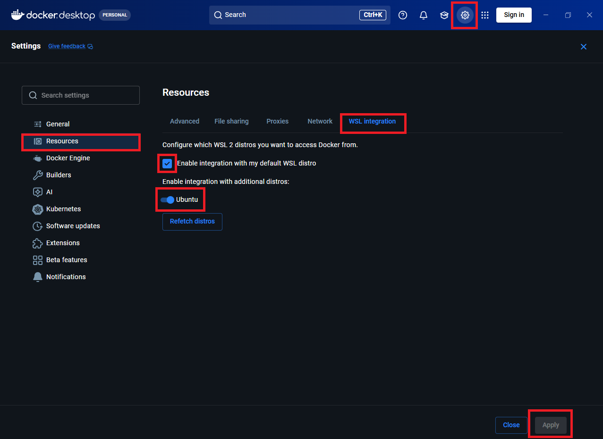
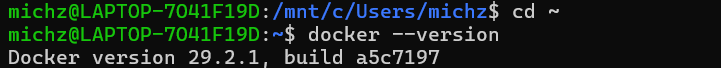
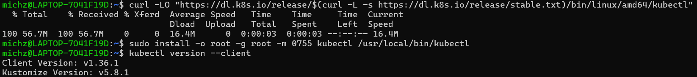
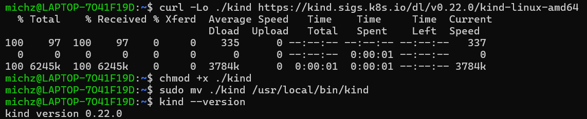
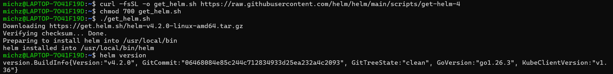
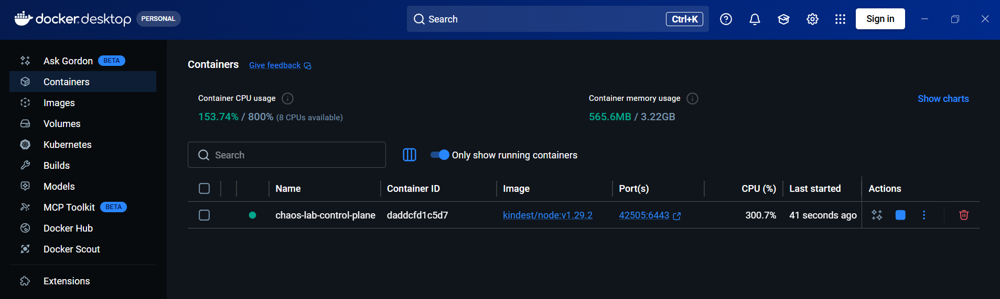

# Chaos Engineering: Resilience Testing with Chaos Mesh
## AGH Large Scale Computing Project
### Authors: Tomasz Krępa, Michał Zienkowicz

## Introduction:
This instruction provides materials necessary for experimenting with Chaos Engineering and Resilience Testing.
The project includes deploying a multi-servie application on Kubernetes (Kind) and instrumenting it with basic health metrics. Then systematic failure injection is demonstrated (pod kills, network partitions, latency injections and CPU/memory stress). This excersise, allows you to see how each failure manifests in the metrics and how the system recovers.

## Tools used:
[...]

# Instruction:

## 1. Docker Desktop (& WSL)
Firs, we recommend using Docker Desktop, which you can install via following link:
[https://docs.docker.com/desktop/](https://docs.docker.com/desktop/)

Most of tools in this excersise are designed for Linux OS. If you work on machine with Windows, we recommend installing Linux via WSL. In our case we have used [Linux Mint](https://linuxmint.com/), but most of distributions are expected to be compatible:
[https://learn.microsoft.com/en-us/windows/wsl/install](https://learn.microsoft.com/en-us/windows/wsl/install)

If you are using Linux via WSL, make sure to enable WSL integration in Docker Desktop by going to `Settings` -> `Resources` -> `WSL Integration` and enabling the integration.

You can check your setup by running `docker --version` in the Bash (or WSL terminal):

## 2. kubectl 
You can install [kubectl](https://kubernetes.io/docs/reference/kubectl/) via bash commands:

`curl -LO "https://dl.k8s.io/release/$(curl -L -s https://dl.k8s.io/release/stable.txt)/bin/linux/amd64/kubectl"`

`sudo install -o root -g root -m 0755 kubectl /usr/local/bin/kubectl`

and check the installation using:

`kubectl version --client`

## 3. kind
Install [kind](https://kind.sigs.k8s.io/docs/user/quick-start/) using something like:

`curl -Lo ./kind https://kind.sigs.k8s.io/dl/v0.22.0/kind-linux-amd64`

`chmod +x ./kind`

`sudo mv ./kind /usr/local/bin/kind`

(`kind --version`)

## 4. Helm
We recommend installing [Helm](https://helm.sh/docs/intro/install/) using instructions provided on its website:

`curl -fsSL -o get_helm.sh https://raw.githubusercontent.com/helm/helm/main/scripts/get-helm-4`

`chmod 700 get_helm.sh`

`./get_helm.sh`

(`helm version`)

## 5. Creating your cluster  
After succesfull installations, you should be able to create your cluster, which will be your playground for the rest of this excersise. In our case, we named it `chaos-lab`

`kind create cluster --name chaos-lab`

You should see the cluster running in your Docker Desktop panel: 

*If during your experiments the system will get too damaged (stop responding), you can always delete it using*** `delete cluster --name chaos-lab`, ***and create a new one.*

